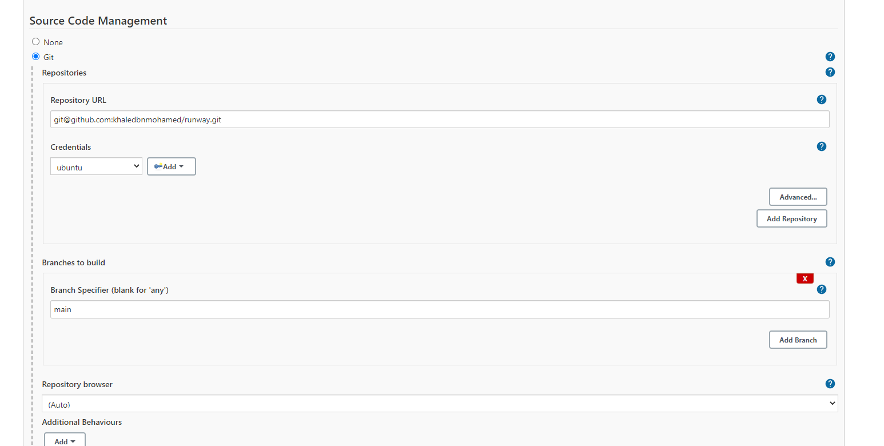

CET-013

# Task Summary

* Create a Web API that List/save/get countries in/from DynamoDB using NodeJS and serverless framework  **Which is CloudFormation stack under the hood**


## :large_blue_diamond: Implementaion Guidea
1) [Create an EC2 Instance and install jenkins on it](https://www.jenkins.io/doc/tutorials/tutorial-for-installing-jenkins-on-AWS/#Download%20and%20Install%20Jenkins)
2) Create a Github Repo that contains your project
   
      [Runway Repo](https://github.com/khaledbnmohamed/runway`)
3) Install needed plugins on Jenkins
4) Add SSH credentials for Github
5) Create a new Job on jenkins
6) Specifiy the Github repo for this job
   aش
   Example:
   ش

7) Check the build trigger for Github hookيs
   
   Example:
   
8) [Add Github Credentials to Jenkins GLOBALLY](https://plugins.jenkins.io/github/)
   
      **Hint: TOKEN created must contains these previleges in github**
      
9)  [Add AWS Credentials to Jenkins](https://www.jenkins.io/doc/book/using/using-credentials/#:~:text=From%20the%20Jenkins%20home%20page,Add%20Credentials%20on%20the%20left.)
10) Specifiy this newely added AWS credentials to the Build configuration for the job created

      Example:
      
11) Add Build script
      ```bash
      export DEPLOY_ENVIRONMENT="dev"
      cd /var/lib/jenkins/workspace/Clone-with-https
      curl -L https://oni.ca/runway/2.0.0/linux -o runway
      chmod +x runway
      ./runway deploy
      ```
# Make it Work !

## :large_orange_diamond: Resources :
1) DynamoDB Table
2) S3 Deployment Bucket
   1) S3::BucketPolicy
3) 3 IAM::Roles
4) API Gateway
   1) ApiGateway::RestApi
   2) 2 ApiGateway::Resource
   3) ApiGateway::Deployment
   4) Logs::LogGroup
   5) 4 ApiGateway::Methods
5) Lambda Function

## :large_blue_diamond: Implementaion Guide
1) Deploy `sls deploy`

    You should see something similar to this:
    

    Result API Gateway URL
    ` https://q6g0kpq5s9.execute-api.us-east-1.amazonaws.com/dev/countries `

 ## :large_orange_diamond: Result


  1) Deployment Start
      
  2) Create Country Endpoint

      Url : `https://q6g0kpq5s9.execute-api.us-east-1.amazonaws.com/dev/countries`

      

# References
[Jenkins on AWS](https://www.jenkins.io/doc/tutorials/tutorial-for-installing-jenkins-on-AWS/)
[Setting up a CI/CD pipeline by integrating Jenkins with AWS CodeBuild and AWS CodeDeploy](https://aws.amazon.com/blogs/devops/setting-up-a-ci-cd-pipeline-by-integrating-jenkins-with-aws-codebuild-and-aws-codedeploy/)

[Blog Post](https://www.serverless.com/blog/node-rest-api-with-serverless-lambda-and-dynamodb)

[Create Jenkins Job and Clone Repository From GitHub](https://narenchejara.medium.com/create-jenkin-job-and-clone-project-from-git-b513804d3089#:~:text=Clone%20Project%20From%20Git,(repository)%20from%20the%20Github.&text=Create%20a%20new%20Jenkins%20job,installed%20in%20the%20Jenkins%20machine.)
# Hints
How to define dependicies in the runway stacks file?

[Blog Post](https://www.serverless.com/blog/node-rest-api-with-serverless-lambda-and-dynamodb)
